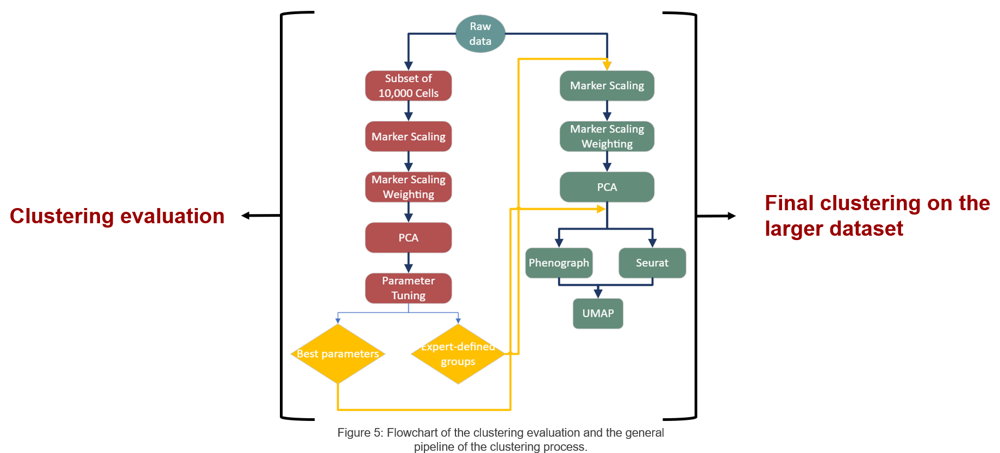

# Developing a marker-scaled clustering algorithm for improved population identification in single cell cytometry data

### Introduction:
---
The immune system is crucial for human health, comprising innate and adaptive immunity. Understanding immune cell subsets aids in diagnosing and treating immune-related disorders. Single-cell cytometry, particularly mass cytometry (CyTOF), offers detailed insights into immune cell behavior but faces challenges in data analysis due to its complexity.

### Objective:
The primary goal is to develop a marker-scaled clustering method for single-cell cytometry data analysis. This method aims to overcome limitations of manual gating and existing automated techniques by integrating biological knowledge directly into the analysis process.

### Approach:
The algorithm incorporates predefined marker groups identified by immunologists, bridging the gap between computational clustering and biological understanding. By integrating expert-defined marker groups, the method aims to identify clusters both statistically significant and biologically meaningful.

### Methodology:
The study analyzes raw mass cytometry data and two marker-scaled datasets using PhenoGraph and Seurat algorithms. Principal Component Analysis (PCA) adjusts marker group weights and aids visual interpretation. Clustering parameters are evaluated using the Adjusted Rand Index (ARI) to ensure effective cluster identification.

-----------------

## Marker scale Hypothesis
The research project’s hypothesis was driven by the difficulties associated with conventional
clustering techniques used in cytometry data. This can be summarized as follows:
Clustering cytometry data poses a challenge because researchers have constraints on the
number of markers they can simultaneously measure in a single experiment, thus requiring
careful marker selection due to the limited panel size. More specifically, in flow cytometry,
spectral overlap restricts the number of fluorescent markers that can be simultaneously
analyzed, while in mass cytometry, the limitation arises from a narrower range of available
metal isotope-labeled antibodies compared to fluorescent ones. While some cell types are
identified by only a few lineage markers, others depend on a more comprehensive set of
markers. This difference in marker representation can create challenges for distance-based
clustering algorithms, as they may face difficulty in appropriately weighting the markers,
especially when markers are associated with multiple cell types. This complicates the
accurate separation of cell populations and undermines the effectiveness of unsupervised
clustering methods.

To address these challenges, this research emphasizes the significance of a user-informed
clustering approach. This method allows researchers to incorporate their insights into the
selection of markers for analysis based on their knowledge about biology and experimental
design, thus improving the algorithm’s ability to achieve precise separation of cell populations
by leveraging researchers’ expertise. In this research, we leverage groups defined by
immunologist experts to guide the selection of markers and enhance the clustering process, as shown in the table below.

In response to the marker weighting challenge, Principal Component Analysis scaling can
be used to tackle this issue. PCA scaling is performed to standardize marker sets for
each anticipated cell type, ensuring that markers are fairly weighted in the clustering
process even when they are shared among multiple cell types. The hypothesis is that
this improves the algorithm’s ability to effectively.

### Population Group Markers

| Population Group   | Markers                        |
|--------------------|--------------------------------|
| CD4pos Naive       | CD4, CCR7, CD45RA              |
| CD8pos Eff         | CD8, CD25                      |
| CD4pos CM          | CD4, CCR7, CD45RA              |
| CD4pos Eff         | CD4, CD25                      |
| CD4pos Treg        | CD4, CD25, CD127               |
| NKT                | CD56, CD14, CD19               |
| CD8pos Naive       | CD8, CCR7, CD45RA              |
| B cells Naive      | CD27, CD38                     |
| Monocytes          | CD16pos, CD16neg               |
| CD8pos EM          | CD8, CCR7, CD45RA              |
| CD4pos EM          | CD4, CCR7, CD45RA              |
| TCRgd              | TCRgd                          |
| B cells Transitional | CD27, CD38                   |
| pDCs               | CD16, HLADR, CD123             |
| mDCs               | CD16, HLADR, CD11c             |
| NK cells           | CD56bright, HLADR, CD16, CD56 |
| CD8pos CM          | CD8, CCR7, CD45RA              |
| B cells Memory     | CD27, CD38                     |
| Basophils          | CD123, CD38, HLADR             |
| Plasmablasts       | CD27, CD38                     |
| major pop markers  | CD3, CD19, CD20, CD14          |

-----------------

## General flowchart

-----------------

## Dataset
https://drive.google.com/file/d/1Xx5vSa4P-aiRD1f5tmPajv231fAUsnic/view?usp=drive_link

